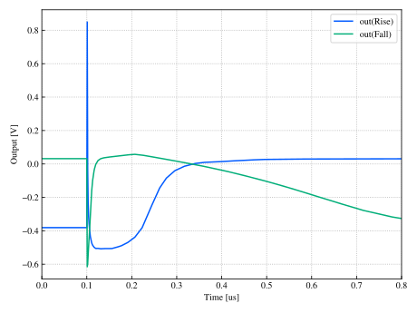

# シミュレーション結果

| 項目                   |        値 | 最低満たすべき条件       |
|------------------------|-----------|--------------------------|
| FOM (dep1)             | 1.636e+20 | 今回の解析で算出         |
| FOM (dep2)             | 1.320e+22 | 今回の解析で算出         |
| FOM (dep3)             | 9.610e+05 | 今回の解析で算出         |
| FOM (dep4)             |         - | 今回の解析で算出         |
| 電源電圧(V)            | 1.200e+00 | -                        |
| 消費電流(A)            | 5.695e-06 | 各解析で基準値の±50%以内 |
| 消費電力(W)            | 6.834e-06 | <= 100 mW                |
| 出力抵抗(Ω)            | 1.000e-01 | -                        |
| 直流利得(dB)           | 4.126e+01 | >= 40 dB                 |
| 位相余裕(deg)          | 5.369e+01 | >= 45 deg                |
| 利得帯域幅積(Hz)       | 1.222e+06 | >= 1 MHz                 |
| 入力換算雑音(V)        | 1.064e-03 | -                        |
| スルーレート(V/s)      | 1.082e+11 | >= 100 kV/s              |
| 全高調波歪(%)          | 7.411e-01 | <= 1.0 %                 |
| 同相除去比(dB)         | 5.978e+01 | >= 40 dB                 |
| 電源電圧変動除去比(dB) | 6.146e+01 | >= 40 dB                 |
| 同相入力範囲(%)        | 7.451e+01 | >= 5.0 %                 |
| 出力電圧範囲(%)        | 3.866e+01 | >= 5.0 %                 |
| 占有面積(mm²)          | 2.349e-03 | <= 1 mm²                 |

## SR波形プレビュー

